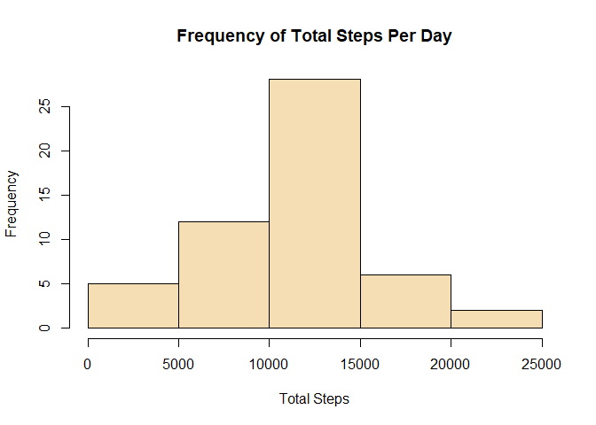
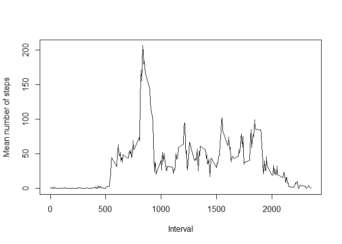
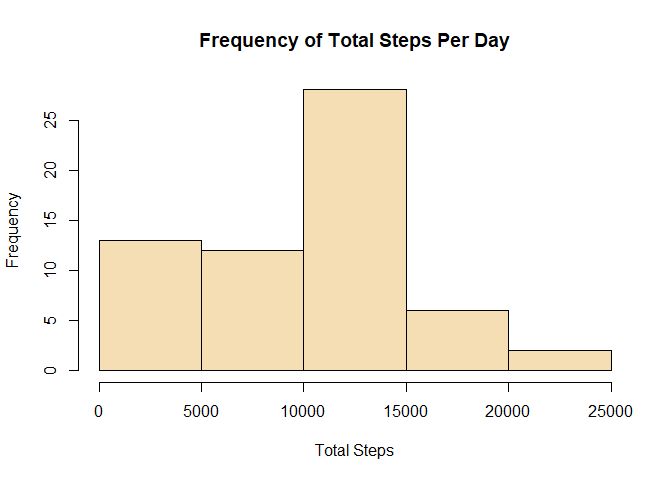
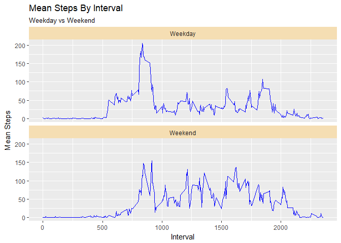

### Loading and preprocessing the data

The data zip file should be in the working directory. 
If the file hasn't already been unzipped, unzip it and read the file.


```r
if (!file.exists("activity.csv")) {
    unzip("activity.zip")
} 

activityData <- read.csv("activity.csv")
```

### What is mean total number of steps taken per day?
I'm loading magrittr and dplyr to use piping (%>%) and group_by

```r
library(magrittr)
library(dplyr)
```

```
## 
## Attaching package: 'dplyr'
```

```
## The following objects are masked from 'package:stats':
## 
##     filter, lag
```

```
## The following objects are masked from 'package:base':
## 
##     intersect, setdiff, setequal, union
```

```r
totalStepsByDate <- activityData %>%
    group_by(date) %>%
    summarise(total.steps = sum(steps))
    
hist(totalStepsByDate$total.steps, 
     xlab = "Total Steps", 
     main = "Frequency of Total Steps Per Day",
     col = "wheat")
```

<!-- -->

This is the mean of the total steps per day.


```r
mean(totalStepsByDate$total.steps, na.rm = TRUE)
```

```
## [1] 10766.19
```

This is the median of the total steps per day.


```r
median(totalStepsByDate$total.steps, na.rm = TRUE)
```

```
## [1] 10765
```

### What is the average daily activity pattern?


```r
totalStepsByInterval <- activityData %>%
    group_by(interval) %>%
    summarise(mean.steps = mean(steps, na.rm=TRUE))

with(totalStepsByInterval, 
     plot(interval, 
          mean.steps, 
          type="l",
          xlab="Interval",
          ylab="Mean number of steps"))
```

<!-- -->

### The 5-minute interval that, on average, contains the maximum number of steps


```r
maxSteps <- max(totalStepsByInterval$mean.steps, na.rm = TRUE)
maxStepsInterval <- subset(totalStepsByInterval, mean.steps == maxSteps)
maxStepsInterval$interval
```

```
## [1] 835
```

### Imputing missing values

#### Calculate and report the total number of missing values in the dataset (i.e. the total number of rows with NAs)

The number of rows with missing values. Turns out the number of rows with missing values is the same as the total number of missing values as they all occur only in the 'steps' column.


```r
nrow(activityData[rowSums(is.na(activityData)) > 0,])
```

```
## [1] 2304
```

#### Devise a strategy for filling in all of the missing values in the dataset. 
I'm going to replace the NA value with the median number of steps for that interval over all days.

#### Create a new dataset that is equal to the original dataset but with the missing data filled in.


```r
medianStepsByInterval <- aggregate(steps ~ interval, data=activityData, median)

activityData2 <- merge(activityData, medianStepsByInterval, by="interval")

names(activityData2)[2]<-"steps"
names(activityData2)[4]<-"median.steps.by.interval"

activityData2$steps[is.na(activityData2$steps)] <- activityData2$median.steps.by.interval[is.na(activityData2$steps)]
```


#### Make a histogram of the total number of steps taken each day and calculate and report the mean and median total number of steps taken per day. Do these values differ from the estimates from the first part of the assignment? What is the impact of imputing missing data on the estimates of the total daily number of steps?


```r
totalStepsByDateNoNAs <- activityData2 %>%
    group_by(date) %>%
    summarise(total.steps = sum(steps))
    
hist(totalStepsByDateNoNAs$total.steps, 
     xlab = "Total Steps", 
     main = "Frequency of Total Steps Per Day",
     col = "wheat")
```

<!-- -->
     
This is the mean of the total steps per day.


```r
mean(totalStepsByDateNoNAs$total.steps, na.rm = TRUE)
```

```
## [1] 9503.869
```

This is the median of the total steps per day.


```r
median(totalStepsByDateNoNAs$total.steps, na.rm = TRUE)
```

```
## [1] 10395
```

The mean and median both change when missing data is replaced. If the NAs are ignored the data is normally distributed. When the data is replaced by median (the vast majority of median values for a time period was 0), the most noticeable difference is the first bin is much bigger so we no longer have a normal distribution of data.

### Are there differences in activity patterns between weekdays and weekends?
Short answer: Yes.

I'm de-factoring the date column so I can apply weekdays() to it. Then I'm adding a column to the no-NAs data frame called 'week' that contains either 'Weekday' or 'Weekend' depending on the date.


```r
activityData2$date <- as.Date(activityData2$date, format="%Y-%m-%d")
activityData2$week <- ifelse(weekdays(activityData2$date) %in% c("Saturday", "Sunday"), "Weekend", "Weekday")

totalStepsByInterval2 <- activityData2 %>%
    group_by(interval,week) %>%
    summarise(mean.steps = mean(steps, na.rm=TRUE))

library(ggplot2)

gg <- ggplot(totalStepsByInterval2,
       aes(interval, mean.steps)) +
       facet_wrap(~week, ncol=1) +
    geom_line(color="blue") +
    theme(strip.background =element_rect(fill="wheat")) +
    labs(title="Mean Steps By Interval", 
         subtitle="Weekday vs Weekend",
         y="Mean Steps", 
         x="Interval")
print(gg)
```

<!-- -->

It looks like the test subjects got up a bit later on the weekends and were more active during the weekend days. There was also slightly more activity later in the evening on weekends.
